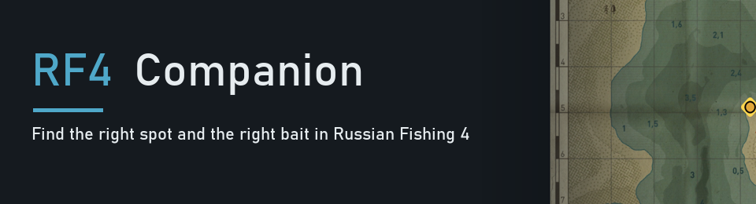
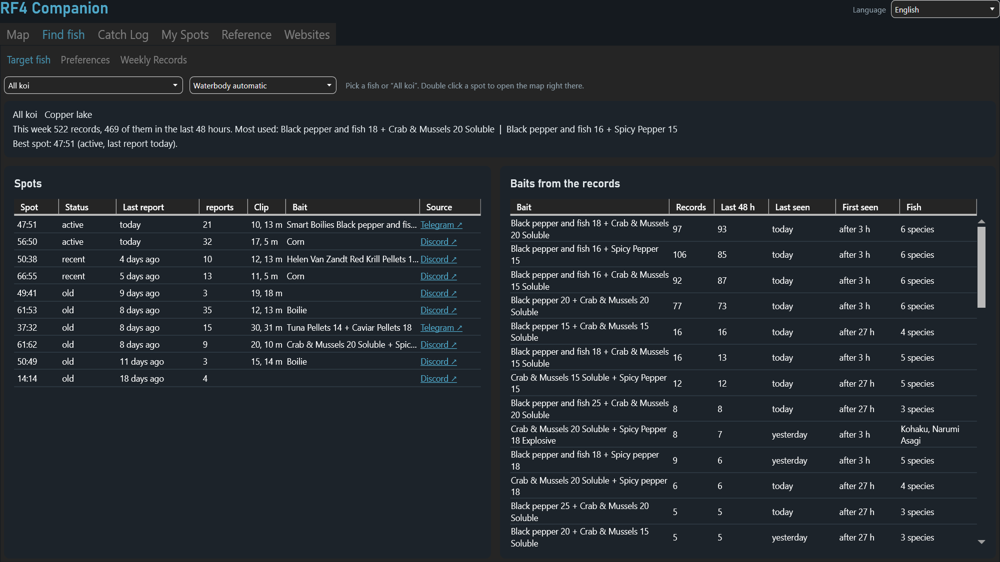
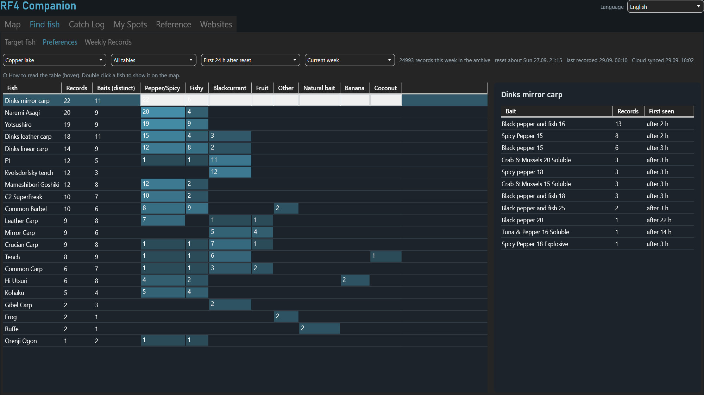
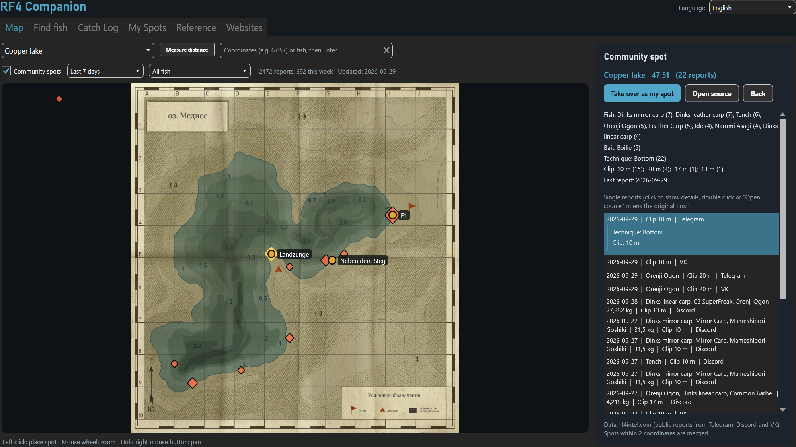
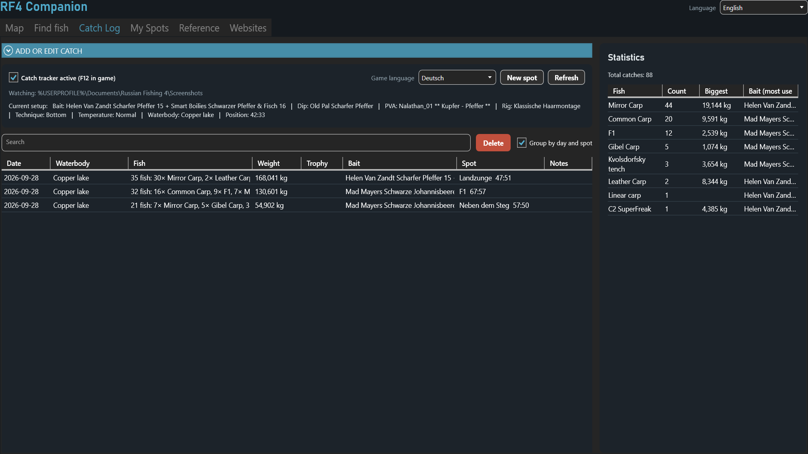
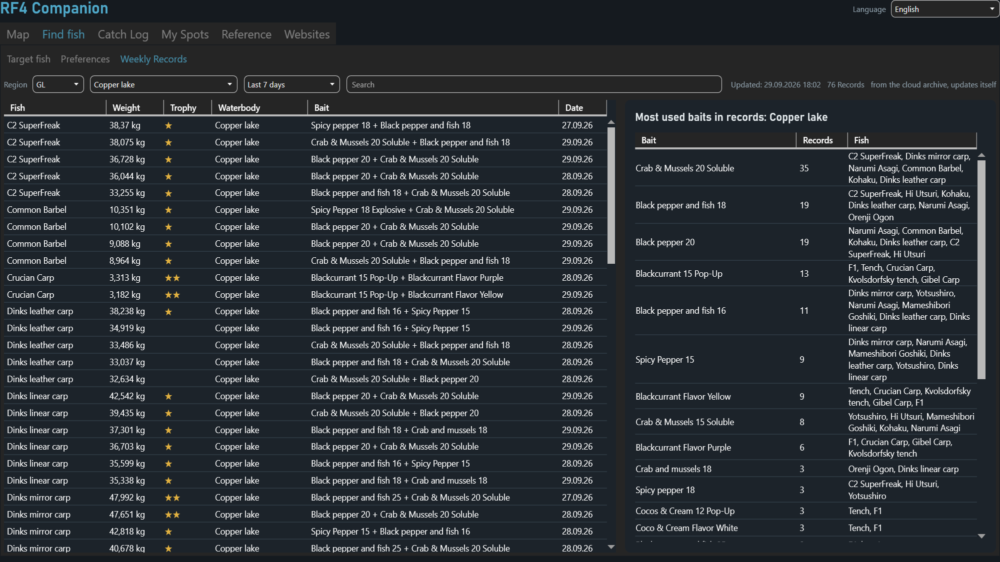

# RF4 Companion

**Find the right spot and the right bait in Russian Fishing 4.**

RF4 Companion is a free Windows tool that runs next to the game. It combines the official weekly records, community spot reports and your own catches, and tells you in plain words where and with what to fish right now.

**Download:** [nalathan.itch.io/rf4-companion](https://nalathan.itch.io/rf4-companion)

## Features

* **Target fish:** pick a fish or "All koi" and get the most promising spots and baits. Spots are weighted by the age of their reports, because koi and other special fish usually stay at a spot for only two or three days. Every spot links to the original community post.
* **Preferences:** a fish by flavour table built from the weekly records of all regions, filterable by the first 6, 12, 24 or 48 hours after the weekly reset.
* **Weekly records:** all three official weekly tables (records, light, bottom light) for all regions, updated automatically.
* **Map:** all waterbodies with your own spots, community spots filtered by fish and period, a ruler and coordinate search. Double click a fish anywhere in the app to see it on the map.
* **Catch log with screenshot tracker:** press F12 in the game as usual. The app reads setup, catch screen, keepnet, fish market, map and recipe screenshots and suggests catches with fish, weight, bait, dip, PVA, position and water temperature.
* **Reference:** waterbodies, trophy weights and your own groundbait and PVA recipes.
* **16 languages**, the same as the game.

## Requirements

* Windows 10 or 11
* Microsoft Edge WebView2 Runtime (present on almost every Windows PC)
* For the screenshot tracker: the Windows OCR language of your game language

## Installation

1. Download the zip from [itch.io](https://nalathan.itch.io/rf4-companion) and unzip it.
2. Run `Setup.cmd` and follow the steps.
3. Uninstall any time via the Windows settings.

To run it from this repository instead: start `Start RF4 Companion.vbs`. `Build-Release.ps1` builds the installer zip into `dist\`.

## Privacy

Everything you enter stays on your PC in `%APPDATA%\RF4Companion`. No account, no tracking, no telemetry. The tracker only reads the RF4 screenshot folder. The app downloads public data only: the anonymised weekly records archive ([rf4-companion-data](https://github.com/Nalathan01/rf4-companion-data)) and public community reports.

## Data sources and credits

* Weekly records: official record tables on rf4game.com, archived without player names.
* Community spots: [rf4intel.com](https://rf4intel.com), public reports from Telegram, Discord and VK.
* Maps, fish and item names: Russian Fishing 4 by Fishsoft.
* Libraries: [MahApps.Metro](https://github.com/MahApps/MahApps.Metro) and [ControlzEx](https://github.com/ControlzEx/ControlzEx) (MIT), [Microsoft.Xaml.Behaviors.Wpf](https://github.com/microsoft/XamlBehaviorsWpf) (MIT), [Microsoft Edge WebView2](https://developer.microsoft.com/microsoft-edge/webview2/).

## Disclaimer

RF4 Companion is an unofficial fan tool. It is not affiliated with, endorsed by or connected to Fishsoft or Russian Fishing 4. All game names, maps and images belong to their respective owners. If you are a rights holder and want something removed, please open an issue.

---

## Deutsch

RF4 Companion ist ein kostenloses Windows-Tool, das neben Russian Fishing 4 läuft. Es verbindet die offiziellen Wochenrekorde, Community-Spots und deine eigenen Fänge und sagt dir in Klartext, wo und womit es sich gerade lohnt: Zielfisch mit Spots und Ködern, Vorlieben nach Aroma, Wochenrekorde aller Regionen, Karte mit Spots und ein Fangbuch, das deine F12-Screenshots automatisch ausliest.

Download und Installation über [itch.io](https://nalathan.itch.io/rf4-companion): Zip entpacken, `Setup.cmd` starten. Alle Daten bleiben auf deinem PC. Inoffizielles Fan-Tool ohne Verbindung zu Fishsoft.
